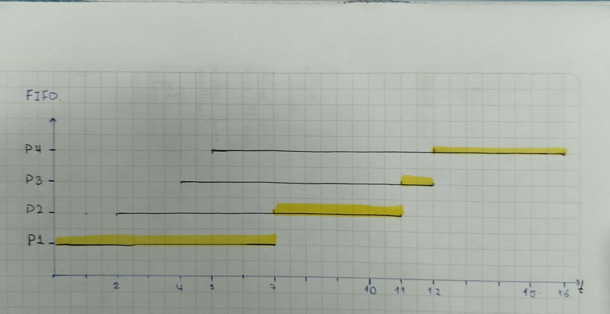
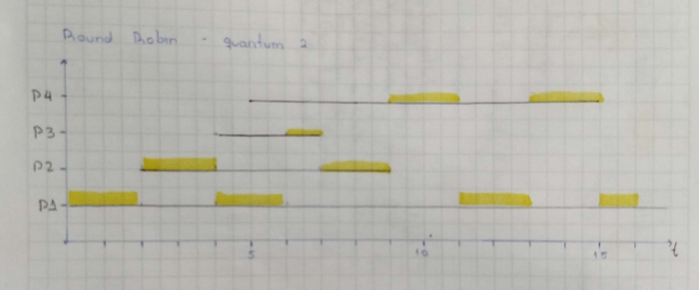

# Bitácora — Taller de planificación de procesos
 
# Integrantes:
- Eddy Sánchez Obando <eddysanchez@unicauca.edu.co> 

## Diagramas de Gantt y tablas de tiempos
 
### FIFO (orden de llegada: P1, P2, P3, P4)

 
| Proceso | Llegada | Ráfaga | Espera | Retorno |
|---|---|---|---|---|
| P1 | 0 | 7 | 0 | 7 |
| P2 | 2 | 4 | 5 | 9 |
| P3 | 4 | 1 | 7 | 8 |
| P4 | 5 | 4 | 7 | 11 |
 
Promedio espera = **4.75** — Promedio retorno = **8.75**
 
### SJF no expropiativo
 

 
En t=7 compiten P2, P3 y P4; gana P3 por tener la ráfaga más corta. En t=8
empatan P2 y P4 con ráfaga 4; el desempate lo decide el orden de llegada, y
P2 llegó primero.
 
| Proceso | Llegada | Ráfaga | Espera | Retorno |
|---|---|---|---|---|
| P1 | 0 | 7 | 0 | 7 |
| P3 | 4 | 1 | 3 | 4 |
| P2 | 2 | 4 | 6 | 10 |
| P4 | 5 | 4 | 7 | 11 |
 
Promedio espera = **4.0** — Promedio retorno = **8.0**
 
### Round Robin, quantum = 2
 

 
| Proceso | Llegada | Ráfaga | Espera | Retorno |
|---|---|---|---|---|
| P1 | 0 | 7 | 9 | 16 |
| P2 | 2 | 4 | 3 | 7 |
| P3 | 4 | 1 | 2 | 3 |
| P4 | 5 | 4 | 6 | 10 |
 
Promedio espera = **5.0** — Promedio retorno = **9.0**
 
### Round Robin, quantum = 1 y quantum = 8
 
- **Quantum = 1**: promedio espera = 5.5, promedio retorno = 9.5.
- **Quantum = 8**: como ningún proceso tiene ráfaga mayor a 8, ninguno se
  expropia nunca → resultado idéntico a FIFO (promedio espera = 4.75).
## Tabla resumen
 
| Algoritmo | Espera promedio | Retorno promedio |
|---|---|---|
| FIFO | 4.75 | 8.75 |
| SJF no expropiativo | 4.0 | 8.0 |
| RR (q=2) | 5.0 | 9.0 |
| RR (q=1) | 5.5 | 9.5 |
| RR (q=8) | 4.75 (= FIFO) | 8.75 (= FIFO) |
 
## Respuestas
 
**Punto 3.** El menor tiempo de espera promedio lo da **SJF (4.0)**. No se
puede usar tal cual en un sistema real porque exige conocer de antemano la
duración de la ráfaga de cada proceso, algo que el sistema operativo no sabe
hasta que el proceso ya terminó de ejecutarse. En la práctica solo se puede
*estimar* (por ejemplo con promedio exponencial de ráfagas anteriores), y
además, al no ser expropiativo, un proceso largo puede sufrir inanición si
siguen llegando procesos cortos que se cuelan siempre delante de él.
 
**Punto 4.** Con quantum = 1 el planificador se acerca al reparto
simultáneo del procesador ("processor sharing"): cada proceso avanza en
pedacitos muy pequeños y da la sensación de ejecutarse casi en paralelo,
mejorando el tiempo de respuesta percibido, pero a costa de muchos más
cambios de contexto (costo que esta simulación no modela). Con quantum = 8,
como ningún proceso tiene una ráfaga mayor a 8, ninguno llega a agotar su
quantum antes de terminar — por lo tanto el resultado es **idéntico a
FIFO**: cuando el quantum es mayor o igual que la ráfaga más larga, RR
degenera en FIFO.
 
**Punto 6.** Al bajar la amabilidad (nice) de un proceso que consume CPU,
en `top`/`ps` cambia la columna `NI` al nuevo valor, y la columna `PR`
(prioridad efectiva del kernel) se ajusta en consecuencia — con nice más
bajo, `PR` baja y el proceso recibe más turnos de CPU frente a los demás.
Lo que **no cambia** es el PID, el nombre del comando, ni la prioridad
*estática* de tiempo real (eso es otro mecanismo aparte). Ojo con el error
clásico: nice **alto** = proceso más "amable" = **cede** más el procesador
= **menos** prioridad, no más.